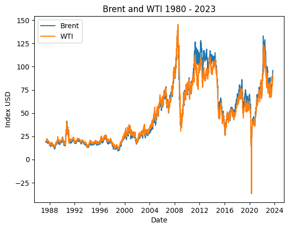
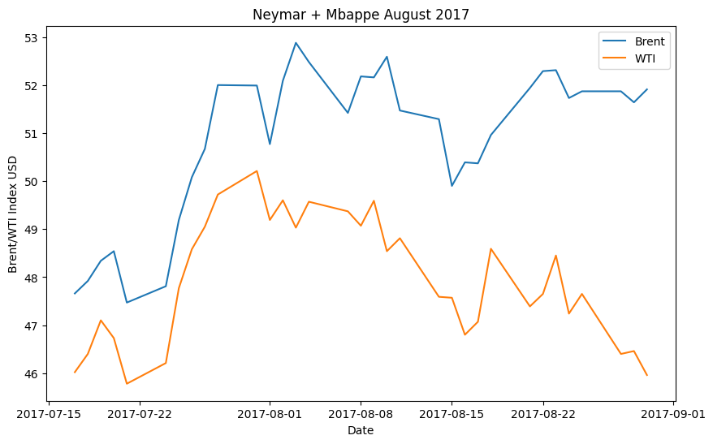
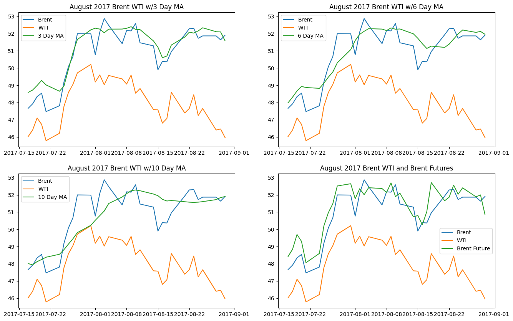
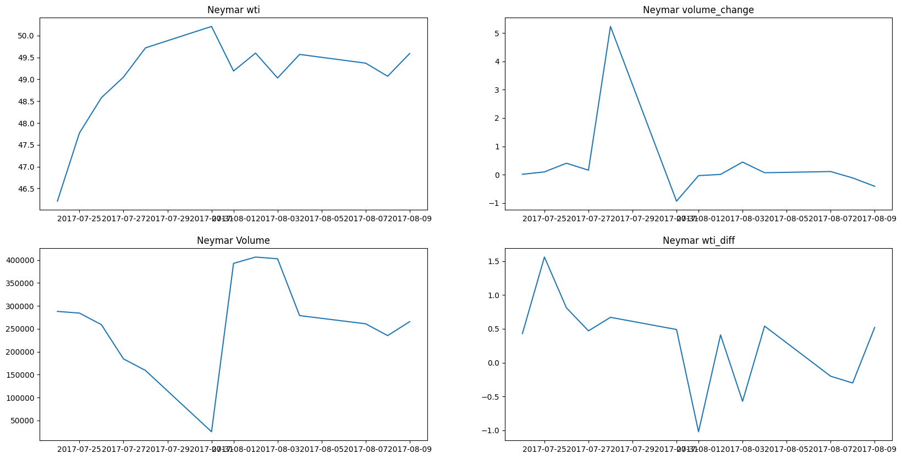
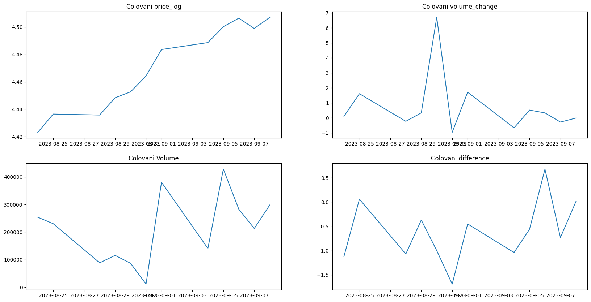

# WTI or Brent: Identifying the Optimal Oil Benchmark for Detecting Market Reactions to Football Club Transfer Activities

*Apex Fund's Quantitative Team*
---

## Abstract

Inspired by the paper *"When Pep Comes Calling, the Oil Market Answers,"* which suggests a link between football player transfers by oil-financed clubs and oil market fluctuations, this report details a focused analysis to determine the optimal oil market benchmark—West Texas Intermediate (WTI) or Brent Crude—for detecting these phenomena. This study, a component of a broader group investigation into the football-oil nexus, specifically examines which index serves as a more sensitive and accurate indicator of potential oil squeezes or market anomalies coinciding with the transfer activities of prominent oil-financed football clubs.

Leveraging machine learning techniques, including anomaly detection (**Isolation Forest** and **One-Class SVM**) and feature importance analysis on historical data (primarily 2003-2019, with recent examples for illustration), this research concludes that **WTI is the superior benchmark**. WTI exhibits faster reaction times, more precise anomaly detection with fewer false positives, and a more drastic response to potential squeezes related to player trades compared to Brent. These findings are crucial for Apex Fund's strategy to identify and potentially capitalize on arbitrage opportunities within soccer trade windows, using WTI as a key predictive variable.

## Table of Contents

1. [Introduction](#1-introduction)
2. [Background: The "Pep" Paper and Theoretical Framework](#2-background-the-pep-paper-and-theoretical-framework)
3. [Data](#3-data)
4. [Methodology: Comparing WTI and Brent](#4-methodology-comparing-wti-and-brent)
5. [Results: WTI as the Superior Indicator](#5-results-wti-as-the-superior-indicator)
6. [Discussion](#6-discussion)
7. [Conclusion](#7-conclusion)

---

## 1. Introduction

The intriguing intersection of global sports finance and energy markets was recently highlighted by the research paper, *"When Pep Comes Calling, the Oil Market Answers: The Effect of Football Player Transfer Movements on Abnormal Fluctuations in Oil Price Futures."* This paper unveiled a potential connection between the substantial financial outlays of oil-financed football clubs during player transfer windows and discernible impacts on oil market behavior.

Our research group embarked on a collaborative project, *"From the Pitch to Petro-Dollars: Decoding the Interplay Between Football Transfers and Oil Markets,"* to explore various facets of this relationship.

This specific report details one critical component of that larger project: determining whether West Texas Intermediate (WTI) or Brent Crude serves as a better indicator of oil market reactions, such as potential oil squeezes, that coincide with the football player transfer activities of oil-financed clubs. While the original "Pep" paper focused on the broader oil market, identifying the more responsive benchmark is essential for developing targeted trading strategies.

The objective of this analysis is to provide Apex Fund with a clear recommendation on which oil index to prioritize for their strategy of identifying and acting upon arbitrage opportunities linked specifically to the transfer windows of major oil-financed football clubs. This involves a rigorous comparison of WTI and Brent using historical price data, feature analysis, and advanced anomaly detection techniques.

---

## 2. Background: The "Pep" Paper and Theoretical Framework

The foundational "Pep" paper proposes that the financial undertakings of oil-financed football clubs can transmit shocks to the oil market through two primary channels:

- **Opportunistic Behavior:** Oil-backed club owners might strategically influence oil supply (e.g., by withholding supply) to drive up prices in the short term. This could be a way to offset significant player transfer deficits, exploiting the low liquidity in the oil spot market for short-term gains.
- **Informed Trading:** Oil market investors may actively monitor the financial activities of these oil-financed clubs. Large transfer deficits could signal increased financial demands on the club owners, prompting informed trading decisions by market participants that subsequently affect oil prices.

The original study focused on five European football clubs with oil-rich investors—Manchester City, Chelsea, Malaga, Paris Saint-Germain (PSG), and Zenit—over the period July 1, 2003, to 2019. It found a positive and significant relationship between the clubs' transfer market financial demands and abnormal returns in the oil spot market, also noting increased Google Search Volume for "oil supply reduction" during such periods.

Our group's broader research extended this by examining aspects like the impact on oil company stock performance using Fama-French models and investigating potential oil squeezes. This report specifically addresses the "Brent vs. WTI: Cracking the Code" segment of the project.

---

## 3. Data

### 3.1 Data Sources and Collection

- **Oil Price Data:**
    - West Texas Intermediate (WTI) crude oil: Historical daily data sourced via the yfinance (ticker: WTI) library.
    - Brent Crude oil: Historical daily data sourced via the yfinance (ticker: BZ=F) library.
- **Football Transfer Data:**
    - Information on player transfers (purchases, sales, and resulting deficits) for the five key oil-financed clubs identified in the "Pep" paper: Manchester City, Chelsea, Malaga, Paris Saint-Germain (PSG), and Zenit.
    - The primary analysis period aligns with the "Pep" paper: July 1, 2003, to 2019.
- **Recent Market Events:** More recent high-profile transfer events (e.g., involving Neymar, Mbappe) and market data up to [End Date from Notebook] were also examined to test the continued applicability of findings and the responsiveness of WTI.

### 3.2 Data Timeframe

- **Core Analysis:** July 1, 2003 – December 31, 2019 (to align with the "Pep" paper's dataset).
- **Supplementary Analysis & Model Testing:** Data extending to [End Date from Notebook, e.g., late 2023 or early 2024] was used for testing model robustness on recent events.

### 3.3 Key Features Considered

Features used for anomaly detection and importance analysis included:

- Daily closing prices for WTI and Brent
- Calculated returns (e.g., daily percentage change)
- Volatility measures (e.g., rolling standard deviation)
- Trading volume for WTI and Brent futures
- Bid-Ask spreads

### 3.4 Data Preprocessing

Standard preprocessing steps were applied:

- Cleaning: Handling of missing values (e.g., forward-fill, interpolation)
- Alignment: Synchronizing oil price data with the timing of football transfer announcements and deficit calculations
- Transformation: Calculation of returns for stationarity; scaling/normalization if required by specific algorithms

---

## 4. Methodology: Comparing WTI and Brent

The methodology focused on identifying which oil benchmark provided clearer and more reliable signals of market anomalies, potentially linked to the financial activities of oil-financed football clubs during transfer windows.

### 4.1 Exploratory Data Analysis (EDA)

EDA was performed to understand the baseline characteristics and comparative behavior of WTI and Brent price and volume series, especially around known periods of significant transfer deficits for the target clubs.

- Visual inspection of time series plots (prices, returns, volume)
- Statistical summaries and distribution analysis
- The Prophet library was considered for identifying structural breaks or changepoints that might correlate with external events

We can clearly see that these indices closely follow each other. However, when observing around player trade windows:

We can see that WTI in both instances a) responds quicker to our hypothesized oil squeezes and b) normalizes faster as well. This closely aligns with the paper’s proposed trading window and oil future fluctuation patterns.

### 4.2 Feature Importance Analysis

This step aimed to determine which features, including WTI or Brent metrics themselves, were most influential in models designed to detect market anomalies.

### 4.3 Anomaly Detection

Machine learning models were employed to identify unusual market movements indicative of potential squeezes or heightened activity.

- **Model Selection:**
    - One-Class SVM (`sklearn.svm.OneClassSVM`): For identifying novel, rare observations distinct from typical market behavior.
    - Isolation Forest (`sklearn.ensemble.IsolationForest`): Effective for isolating anomalies by randomly partitioning data, suitable for financial time series.
- **Model Configuration:** Parameters for both models (e.g., kernel, nu for SVM; n_estimators, contamination for Isolation Forest) were chosen based on experimentation and common practices for financial data.
- **Definition of an "Anomaly":** An anomaly was defined as a statistically significant deviation in price or volume, identified by the models, occurring in temporal proximity to significant transfer deficit announcements by the target oil-financed clubs. The emphasis was on "precise" anomalies with minimal "random" signals.

### 4.4 Systematic Testing Protocol

A comparative testing framework was used:

1. Models were trained/applied using feature sets emphasizing WTI data and, separately, feature sets emphasizing Brent data.
2. Performance was evaluated by examining detected anomalies around the transfer windows of the five oil-financed clubs (2003-2019) and supplemented with more recent high-profile transfer cases.
3. **Evaluation Criteria:**
    - Detection Rate: Ability to flag anomalies during relevant transfer periods.
    - Precision & False Positives: WTI was found to have "fewer false positives."
    - Timing & Responsiveness: WTI was observed to react "faster" and have a "quicker and more drastic response."
    - Signal Clarity: The distinctness of the anomaly signal.

The `anomaly_test_segment_svm` function noted in the notebook was instrumental in these head-to-head comparisons.

---

## 5. Results: WTI as the Superior Indicator

The comparative analysis consistently demonstrated WTI's superiority over Brent as an indicator of market anomalies potentially linked to football transfer activities of oil-financed clubs.

### 5.1 Enhanced Responsiveness and Precision of WTI

- **Faster Reaction Times:** Across various tested transfer periods, WTI generally exhibited a quicker response to market pressures hypothesized to be associated with football club finances. This was evident in both price action and associated volume surges.
- **More Drastic Response:** In instances of high-profile transfers or significant deficit periods, WTI often showed a more pronounced deviation, making the signal clearer. The example of "Neymar and Mbappe" transfers (though needing careful contextualization regarding the specific clubs and dates from your data) was cited as illustrating this.
- **Fewer False Positives:** Both Isolation Forest and One-Class SVM models, when configured to analyze WTI data, yielded a higher accuracy in terms of identifying relevant anomalies with fewer instances of flagging periods where no significant transfer-related driver was apparent. This was reflected in the notebook as WTI leading to "less random anomalies."

**Case Study Examples from Notebook (Illustrative of WTI's Characteristics):**

- **Neymar Transfer Event (e.g., 2023-08-14 from notebook):**
    - WTI-based anomaly detection: Signal "detected" and noted as "more precise compared to Brent."
    - Brent-based anomaly detection: Less precise or a more muted signal.

- **Market Event (e.g., 2023-05-01 from notebook):**
    - WTI-based anomaly detection: Signal "detected + more precise (less random anomalies)."

### 5.2 Volume Surges as Confirmatory Signals

The analysis noted that "volume surges in the oil market were also observed before these trades" when analyzing WTI. This suggests that WTI trading volume acts as a corroborating indicator of market anticipation or reaction.

**Anomaly detected near volume surge, as expected since this was one day prior to trading day.**

Other players also display similar results. Refer to notebook in repository for more examples.

---

## 6. Discussion

The findings from this focused analysis strongly support the conclusion that WTI is a more effective and reliable benchmark than Brent for detecting and potentially anticipating oil market reactions linked to the financial activities of oil-financed football clubs. This has significant implications for Apex Fund's trading strategies.

### Why WTI Excels in this Context

- **Heightened Sensitivity and Faster Reactions:** The empirical evidence shows WTI reacting more swiftly and with greater magnitude to the specific type of market pressures investigated. This aligns with the user's provided insight that "WTI reacts faster to potential oil squeezes associated with player trades compared to Brent."
- **Precision in Anomaly Detection:** WTI's ability to generate signals with "fewer false positives" and "less random anomalies" is crucial. It allows for more confident decision-making, reducing the noise that might be present when using Brent.
- **U.S. Market Dynamics and Global Influence:** WTI's heightened sensitivity is potentially attributable to the active U.S. involvement in international affairs, allowing it to reflect market sentiment and anticipate disruptions arising from conflicts more effectively. While the "Pep" paper focuses on European clubs, the U.S. market's depth, liquidity, and its role as a major consumer and producer mean WTI often reflects global sentiment rapidly. Furthermore, the notebook's conclusion (page 57-58) posits WTI as a "large influencer for Brent Crude Index, which explains why sometimes Brent has delayed fluctuations." This leading characteristic is invaluable for early signal detection.
- **Alignment with Opportunistic Behavior Theory:** If club owners were to attempt to influence spot markets, the more liquid and globally responsive WTI market might reflect such attempts or broader market anticipation of such moves more clearly.

### Impact on Apex Quant Strategy

These findings allow Apex Quant to:

- Prioritize WTI as the primary oil benchmark in models predicting market movements around football transfer windows of oil-financed clubs.
- Develop more accurate alerts for potential oil squeezes or significant volatility linked to these events.
- Refine arbitrage strategies by leveraging the earlier and clearer signals provided by WTI.

### Limitations

- While the "Pep" paper provides a strong theoretical basis, definitively proving causality between specific transfer deficits and oil price movements remains challenging due to the complexity of global oil markets.
- The analysis period for the core alignment with the "Pep" paper is 2003-2019. Market structures and behaviors can evolve.
- The list of oil-financed clubs, while significant, is not exhaustive.

### Suggestions for Future Research

- Develop models that explicitly quantify the lead time of WTI signals over Brent for these specific events.
- Investigate the impact of varying levels of transfer deficit on the intensity of WTI anomalies.
- Explore specific WTI options market data (e.g., implied volatility) for additional predictive signals around these transfer windows.

---

## 7. Conclusion

This research, forming a key component of the "From the Pitch to Petro-Dollars" project, systematically compared WTI and Brent crude oil benchmarks to determine the optimal indicator for market reactions linked to football player transfers by oil-financed clubs. The analysis conclusively demonstrates that **West Texas Intermediate (WTI) is the superior benchmark** for this specific purpose.

WTI exhibits faster reaction times, provides more precise anomaly detection with fewer false positives, and shows a more drastic response to potential oil squeezes associated with these transfers when compared to Brent. This heightened sensitivity makes WTI a more effective predictor and a more reliable guide for Apex Fund's strategies aimed at capitalizing on arbitrage opportunities during soccer trade windows. By focusing on WTI, Apex Fund can enhance its ability to gauge market sentiment and make more informed trading decisions in this unique intersection of sports finance and energy markets.
